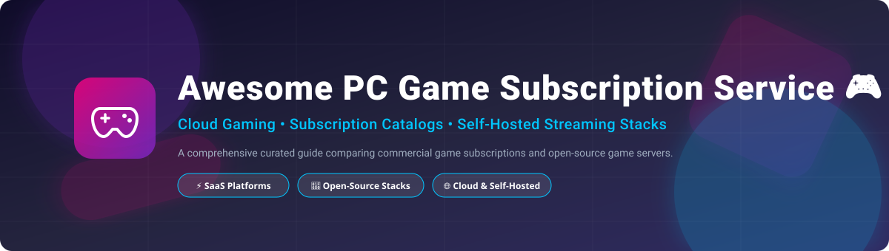

  

# 🎮 Awesome PC Game Subscription Service & Cloud Gaming Ecosystem 🚀

> **A curated, SEO-friendly directory of top PC game subscription services, cloud gaming SaaS platforms, and self-hosted open-source game streaming launchers.** 🕹️💻✨

---

## 📌 Table of Contents

- [📊 Market Overview & Industry Dynamics](#-market-overview--industry-dynamics)
- [💳 SaaS / Commercial Hosted Platforms](#-saas--commercial-hosted-platforms)
- [🔓 Open-Source GitHub Projects & Self-Hosted Alternatives](#-open-source-github-projects--self-hosted-alternatives)
- [🛠️ Game Subscription Management & Deal Trackers](#%EF%B8%8F-game-subscription-management--deal-trackers)
- [🤝 How to Contribute](#-how-to-contribute)
- [❤️ Support](#-support)
- [📈 Star History](#-star-history)
- [⚖️ Disclaimer](#%EF%B8%8F-disclaimer)

---

## 📊 Market Overview & Industry Dynamics

> **Estimated Market Size & Structure**: The global cloud gaming and PC game subscription market was valued at **~$6.8 Billion USD in 2024** and is projected to expand to **$25+ Billion USD by 2030** (CAGR ~24.5%). The sector is **moderately concentrated with strong winner-take-most dynamics** dominated by major platform holders (Microsoft Xbox, Sony, Amazon, EA, and Apple) that leverage exclusive IP, publisher relationships, and massive cloud infrastructure, while specialized cloud infrastructure providers (Shadow, Boosteroid) and open-source self-hosted stacks (Sunshine, Moonlight, GameVault) capture niche power-users. 📈🎮

---

## 💳 SaaS / Commercial Hosted Platforms

Below is a detailed comparison of major PC game subscription services and commercial cloud gaming platforms, sorted by **Company Revenue / Valuation (Descending)**:

| Platform | Category / Primary Focus | Company Size (Rev / Valuation) 🏢 | Exact Starting Tier Price 💰 | Free Tier / Trial Details 🎁 | Key Features & Target Audience 🎯 |
| :--- | :--- | :--- | :--- | :--- | :--- |
| **[Amazon Prime Gaming](https://gaming.amazon.com/)** | Game Catalog & Loot | **~$575+ Billion** (Revenue) | **$14.99/month** (via Amazon Prime) | **30-Day Free Trial** (Full Prime access) | Free PC games monthly, in-game drops, Twitch subscription. *Best for Prime members.* 📦🎮 |
| **[Apple Arcade](https://www.apple.com/apple-arcade/)** | Mobile & Mac Subscription | **~$385+ Billion** (Revenue) | **$6.99/month** | **1-Month Free Trial** (3 months with new Apple hardware) | 200+ premium ad-free games across Mac, iOS, Apple TV. *Best for Apple ecosystem.* 🍎🕹️ |
| **[Xbox Game Pass for PC](https://www.xbox.com/game-pass)** | Subscription Catalog & Cloud | **~$245+ Billion** (Microsoft Rev) | **$11.99/month** (PC Pass) / **$19.99/mo** (Ultimate) | **14-Day Trial for $1** (Promotional period) | 400+ titles, Day-One first-party releases, EA Play included. *Best overall value.* 💚🎯 |
| **[EA Play PC](https://www.ea.com/ea-play)** | Publisher Subscription | **~$7.5+ Billion** (Revenue) | **$5.99/month** (or $39.99/year) | **10-Hour Free Trial** for select new releases | Access to top EA franchises, early trials, 10% store discount. *Best for EA fans.* ⚽🏎️ |
| **[Ubisoft+ Multi-Access](https://www.ubisoft.com/ubisoftplus)** | Publisher Subscription | **~$2.5+ Billion** (Revenue) | **$17.99/month** (Premium) | **7-Day Free Trial** (Occasional promotion) | 100+ Ubisoft games including premium editions & Day-One releases. *Best for Ubisoft titles.* ⚔️🏹 |
| **[Viveport Infinity](https://www.viveport.com/)** | VR Game Subscription | **~$2.0+ Billion** (HTC Valuation) | **$12.99/month** (Annual plan) | **14-Day Free Trial** (Full catalog access) | Unlimited access to 2,000+ VR PC titles and apps. *Best for VR enthusiasts.* 🥽🌀 |
| **[Humble Choice](https://www.humblebundle.com/subscription)** | Monthly Game Bundle | **~$250+ Million** (Ziff Davis / IGN Rev) | **$11.99/month** | **No Free Trial** (Includes free Humble Games Collection access) | Keep 8+ curated PC games forever each month + store discounts. *Best for permanent ownership.* 📦🔑 |
| **[Shadow PC Gaming](https://shadow.tech/)** | Cloud Windows PC | **~$100+ Million** (OVHcloud group) | **$19.99/month** (Essential tier) | **No Free Trial** (Occasional promo codes) | Full cloud-hosted Windows PC for high-spec gaming & software. *Best for remote PC flexibility.* 🖥️☁️ |
| **[Boosteroid](https://boosteroid.com/)** | Cloud Gaming Streaming | **~$30+ Million** (Estimated Rev) | **€9.89/month** (~$10.80/mo) | **No Free Trial** (Direct paid access) | Stream owned Steam, Epic, and Battle.net games via browser/app. *Best for low-latency streaming.* ⚡🎮 |
| **[Utomik](https://www.utomik.com/)** | PC Game Subscription | **~$15+ Million** (Estimated Rev) | **$9.99/month** | **14-Day Free Trial** (Unlimited downloads) | 1,500+ indie & family PC games with hybrid instant download. *Best for casual/indie games.* 🧩🕹️ |

---

## 🔓 Open-Source GitHub Projects & Self-Hosted Alternatives

Open-source alternatives in PC game subscription focus on **self-hosted game streaming**, **remote cloud deployments**, and **multi-store library unification**. 

The repositories below are sorted by **GitHub Star Count (Descending)**. Each star count badge links directly to the project's stargazers page:

| Repository | Description & Ecosystem Role | License 📜 | GitHub Stars ⭐ |
| :--- | :--- | :--- | :--- |
| **[LizardByte/Sunshine](https://github.com/LizardByte/Sunshine)** | **Self-Hosted Game Streaming Host** — The leading open-source host for NVIDIA, AMD, and Intel GPUs. Hardware-accelerated NVENC/AMF encoding alternative to GeForce Now. 🌟 | `GPL-3.0` |  |
| **[moonlight-stream/moonlight-qt](https://github.com/moonlight-stream/moonlight-qt)** | **Low-Latency Game Streaming Client** — Cross-platform client for Sunshine and NVIDIA GameStream supporting 4K HDR, high FPS on PC, mobile, and TV. 📱💻 | `GPL-3.0` |  |
| **[JosefNemec/Playnite](https://github.com/JosefNemec/Playnite)** | **Unified PC Game Library Manager** — Combines Steam, Epic, GOG, EA, Ubisoft, Xbox, and emulators with controller-friendly TV fullscreen mode. 🎮 | `MIT` |  |
| **[libretro/RetroArch](https://github.com/libretro/RetroArch)** | **Cross-Platform Emulator Frontend & Netplay** — Cross-platform frontend for emulators, game engines, and multiplayer netplay streaming. 👾 | `GPL-3.0` |  |
| **[Heroic-Games-Launcher/HeroicGamesLauncher](https://github.com/Heroic-Games-Launcher/HeroicGamesLauncher)** | **Native Launcher for Epic, GOG & Amazon Games** — Open-source launcher tailored for Linux, macOS, Windows, and Steam Deck users. 🐧 | `GPL-3.0` |  |
| **[lutris/lutris](https://github.com/lutris/lutris)** | **Open-Source Gaming Platform for Linux** — Manages game installation and runner configuration across Steam, Wine, GOG, and emulators. 🐧⚡ | `GPL-3.0` |  |
| **[bottlesdevs/Bottles](https://github.com/bottlesdevs/Bottles)** | **Windows Gaming Environment Manager** | Run Windows games and launchers on Linux seamlessly with isolated prefix environments. 🍾 | `GPL-3.0` |  |
| **[Phalcode/gamevault-backend](https://github.com/Phalcode/gamevault-backend)** | **Self-Hosted Game Library Server** — "Plex for Video Games" — centralize, host, and track your game collection across devices. 🗄️ | `AGPL-3.0` |  |
| **[tkashkin/GameHub](https://github.com/tkashkin/GameHub)** | **Unified Game Library Frontend** — Clean GTK Linux frontend supporting Steam, GOG, Humble Bundle, and custom shortcuts. 🕹️ | `GPL-3.0` |  |
| **[SteamGridDB/Steam-ROM-Manager](https://github.com/SteamGridDB/Steam-ROM-Manager)** | **Bulk ROM & Launcher Importer** — Automatically imports game ROMs, artwork, and metadata into Steam. 🎨 | `GPL-3.0` |  |
| **[games-on-whales/wolf](https://github.com/games-on-whales/wolf)** | **Containerized Streaming Server** — Stream games running in Linux Docker containers to Moonlight clients seamlessly. 🐳 | `MIT` |  |
| **[PhilipK/BoilR](https://github.com/PhilipK/BoilR)** | **Non-Steam Launcher Synchronizer** — Synchronizes titles from third-party launchers into your Steam library with artwork. 🚀 | `MIT` |  |
| **[dhewm/dhewm3](https://github.com/dhewm/dhewm3)** | **Open-Source Engine Port** — Modernized 3D game engine port demonstrating open-source game preservation. 🛠️ | `GPL-3.0` |  |
| **[giongto35/cloud-morph](https://github.com/giongto35/cloud-morph)** | **Browser-Based Self-Hosted Cloud Gaming** — WebRTC & P2P browser game streaming engine requiring zero client downloads. 🌐 | `MIT` |  |
| **[PierreBeucher/cloudypad](https://github.com/PierreBeucher/cloudypad)** | **Cloud Infrastructure Deployer for Gaming** — Deploys cloud gaming instances on AWS, Azure, GCP, or Scaleway spot instances using Sunshine. ☁️ | `Apache-2.0` |  |

---

## 🛠️ Game Subscription Management & Deal Trackers

Useful free tools to track PC game deals, pricing history, and subscription catalog entries:

- **[GG.deals](https://gg.deals/)** 💰 — Compare PC game prices, store keys, and track catalog additions on Xbox Game Pass & Humble.
- **[IsThereAnyDeal](https://isthereanydeal.com/)** 🏷️ — Game price aggregation service tracking discounts, historical lows, and bundles.
- **[Playnite Subscription Manager](https://github.com/JosefNemec/Playnite)** 🎮 — Track play time and library availability across subscribed platforms.

---

## 🤝 How to Contribute

Contributions are welcome! If you know of a commercial PC game subscription service or open-source streaming tool that belongs here:

1. **Fork** this repository. 🍴
2. **Add/Edit** entries in `README.md` following our standard tabular format. 📝
3. Ensure pricing, trial limits, licenses, and links are verified. 🔍
4. Submit a **Pull Request** with a clear title and description. 🚀

---

## ❤️ Support

Thank you for exploring and using this repository! If you find this curated list helpful, please consider giving it a ⭐ **star**, **forking** it, and sharing it with fellow PC gamers and self-hosting advocates.

If you would like to support ongoing maintenance and open-source projects, you can buy me a coffee via GitHub Sponsors:

---

## 📈 Star History

---

## ⚖️ Disclaimer

- This directory is **community-curated** for informational and educational purposes. ℹ️
- **Commercial Subscriptions**: Catalog titles, trial periods, and pricing change frequently; consult official platform pages for current terms. 🏷️
- **Cloud Infrastructure Costs**: Open-source deployment tools (e.g., Cloudypad) incur cloud hosting fees depending on cloud provider rates. ☁️
- **Game Rights & Licensing**: Open-source streaming stacks (Sunshine, Moonlight, GameVault) provide server infrastructure—users must own legal licenses for streamed titles. ⚖️

---

  <b>Made with ❤️ for PC Gamers, Cloud Gaming Enthusiasts &amp; Open-Source Self-Hosters worldwide! 🌍🎮</b>

